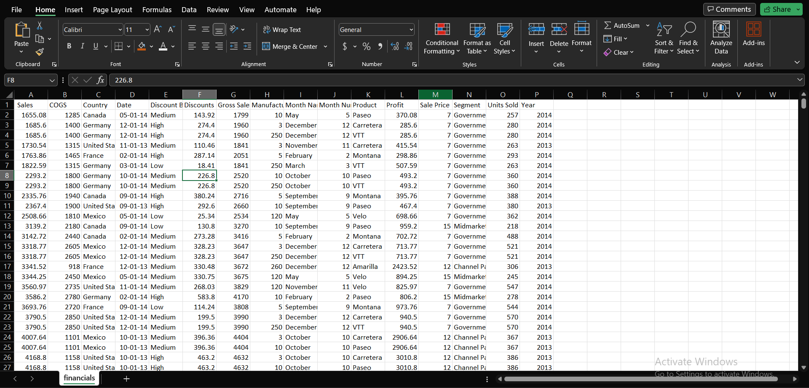
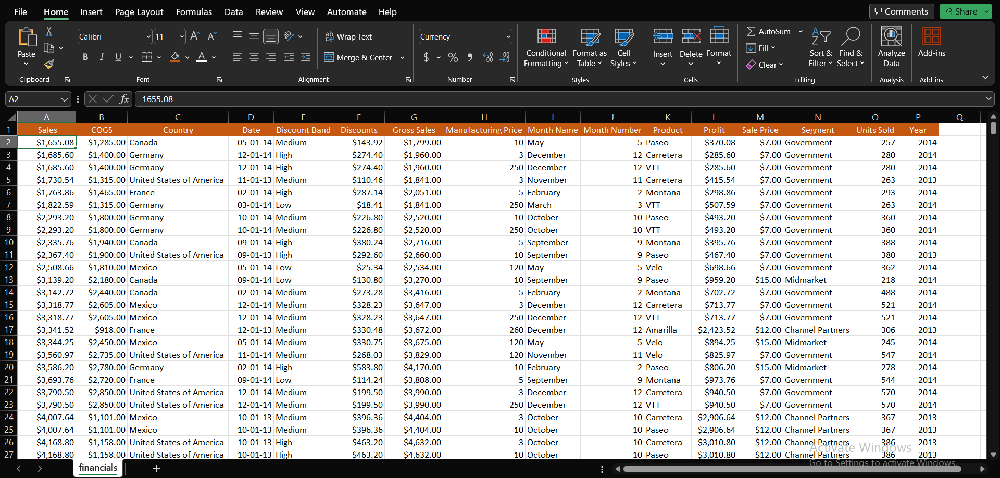
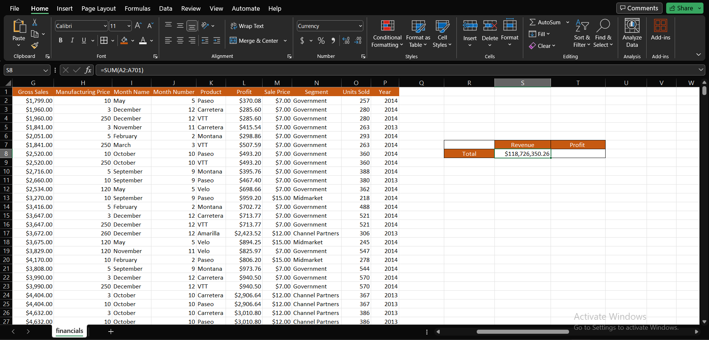
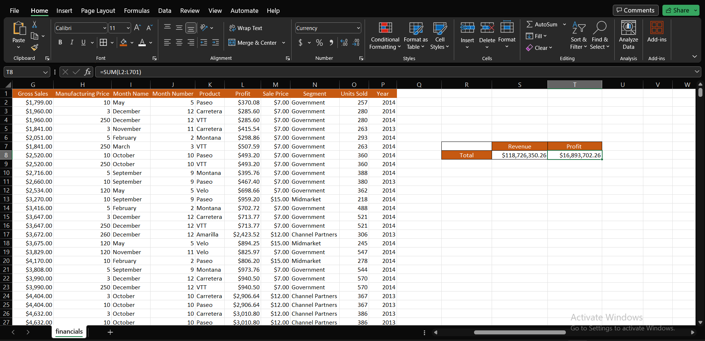
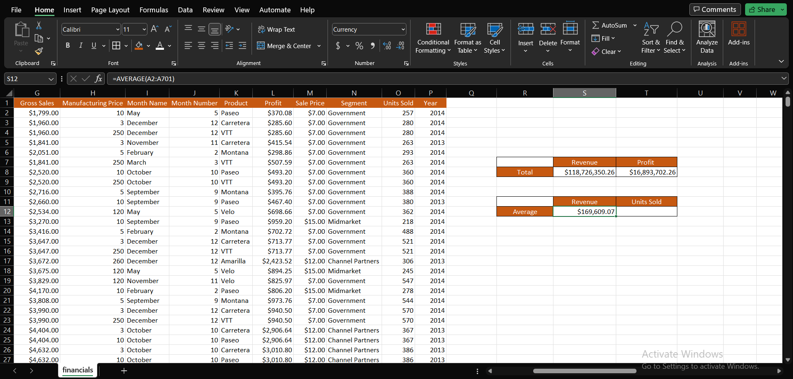
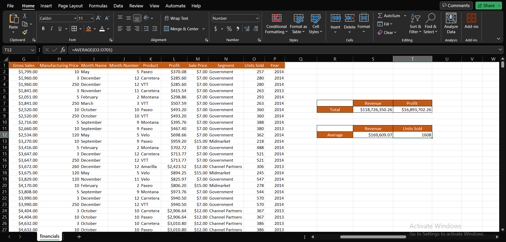
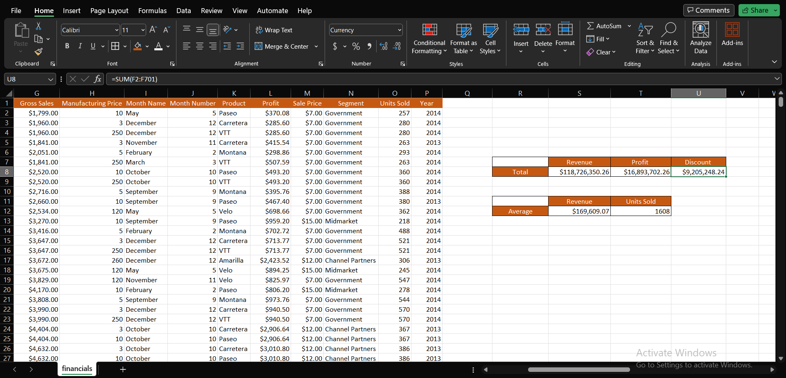
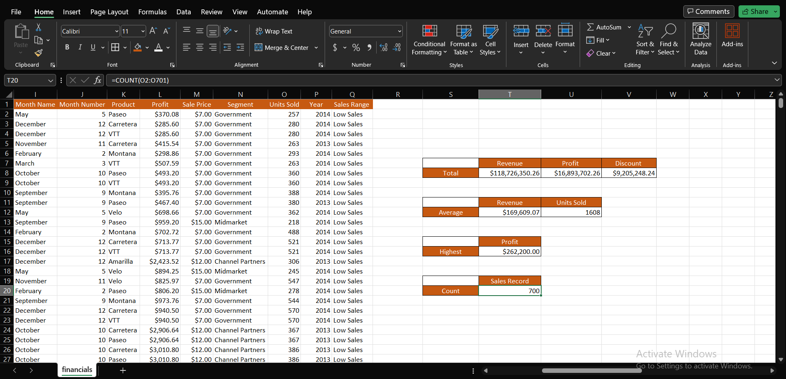
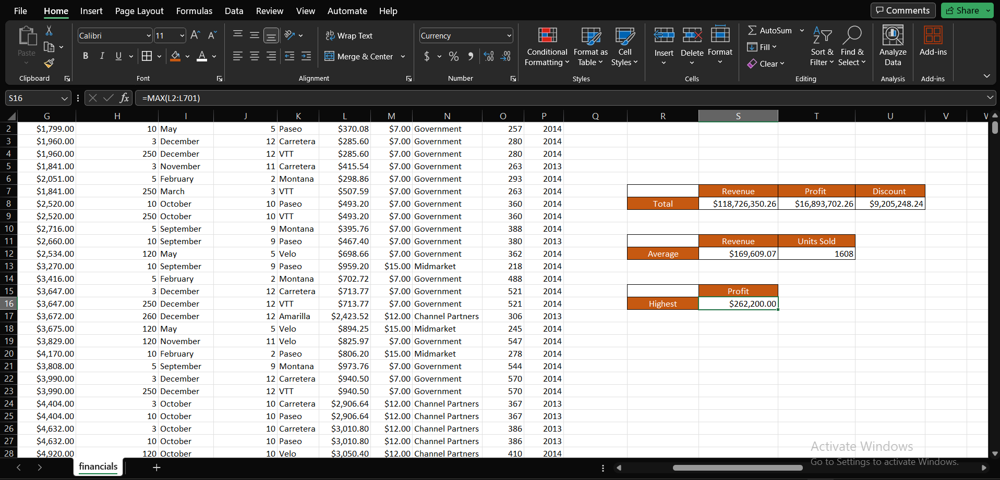
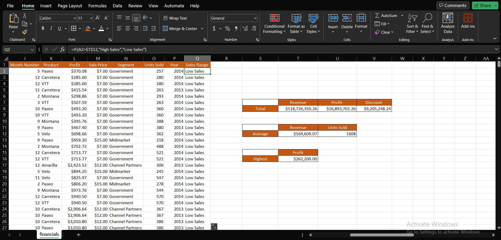

# Data-Analysis-Training-Tasks

## EXCEL TASK 1

### For this task, we were asked to create a worksheet with the first sheet cotaining 20 rows of information with fields of *Employee ID,Employee full name, Department, Salary and Job.* 

I created a table and tried to use names familiar to me. I also used a simple system to formulate the employee id. As for the rest columns I chose them randomly. I also added borders to the data set and filled in the background color of the column headers so make them easy to read. I named the sheet sheet0 and copied data set to sheet 1,2 and 3 because of the other task I had to complete using this same worksheet. 

---

### On the first sheet, we were asked to Show only employees who are 'Freelancers' and highlight the ones whose salaries are above $10000.

For this, I selected the job type column only and clicked on filter, then I filtered to leave just the freelance employees remaining. Then, I used conditional formatting on the salary column to highlight salaries greater than $10000.

---

### On the second sheet, we were asked to split the employees' full names into first name and last name and check for duplicates and highlight if there are any.

For this, I used the text to column feature on the data tab of excel. I first inserted an extra column after the employee name column, then I selected the employee name column and click on the text to column option on the data tab. Data type delimited was already selected and I clicked next, I selected space as the delimiter and next again, data type was already selected as general and destination column was already selected as the current column data was already on and then I clicked finish. It asked if I wanted to replace data on column and I responded yes and the first and last name was split into the column selected and the new column created. I did not have any duplicates.

---

### For the last sheet, we had to highlight employees whose names begin with the letter **_E_** in yellow and format the Salary column such that the highest salary has a green background, and the lowest salary has a red background.

First, I selected the employee name column, then I clicked on conditional formatting and then highlight cell rules and then selected the more rules option. Then, I edited the rule description to format only cells with specific text beginning with **_E_** and also formatted the color to be yellow.
Then, I sorted the salary column to range from largest to smallest and used the green-yellow-red color scale on conditional formatting to highlight the salary range.

---

## EXCEL TASK 2

### For this task we were provided a company’s financial data set. This data set contains 700 rows of information with 16 columns.

---

The data came cleaned and I only had to carry out a few steps to manage the data.
The first thing I did was change the column size to match contents in them, then I filled in the color of the header columns and centered them to make them stand out. I proceeded to change the data types of the columns by changing coulumns refering to money to currency, date to date, text to text and leaving the rest as general.

---

### First task is to determine The total Revenue and Profit generated

For the total Revenue, I summed up the entire sales column using the **SUM** function

---

The total profit generated is gotten from summing up the profit column also using the **SUM** function

---

- It is determined that the _Total Revenue_ is **$118,726,350.26** and _Total Profit_ is **$16,893,702.26**.

### Second task is to determine The average Revenue and Units Sold for every order

For this, I used the **AVERAGE** function on the sales column 

---

I also used the **AVERAGE** function on the units sold column

---

- _Average Revenue_ is **$169,609.07** and _Average Units Sold_ is **1608**.

### Next, is to find The total Discount given in $

Here, I used the **SUM** function on the  discount column to solve this

---

- _Total Discount_ is **$9,205,248.24**.

### Next task is to get the Total number of sales recorded

I was a bit thrown off by this question as I did not know exactly what function to use. I decided on using the **COUNT** function as I belived the question to determine how many times a sale was recorded.

---

- _Total Number of Sales Recorded_ is **700**.

### The following task is to detrmine the The highest Profit generated

I used the **MAX** function on the profit column for this question

---

- _Highest Profit_ is **$262,200.00**

### Final task is to Create a column named 'Sales Range', and return 'High Sales' if the Sales value is above average, otherwise, return 'Low Sales' 

I created a new column and titled it _Sales Range_ and used the **IF** function to find the sales range by Using the sales column and using absolute reference to reference the cell containing the average sale value.

---

- **472** records are shown to be _Low Sales_ and the rest were _High Sales_. 

 

